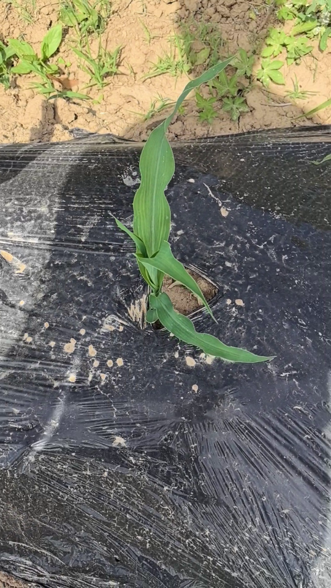
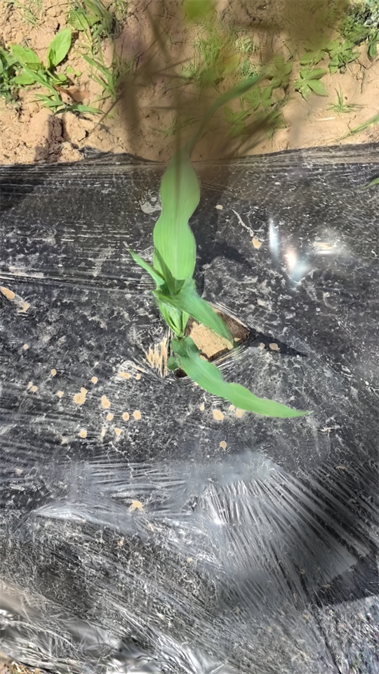
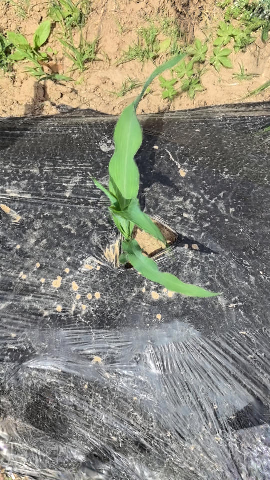
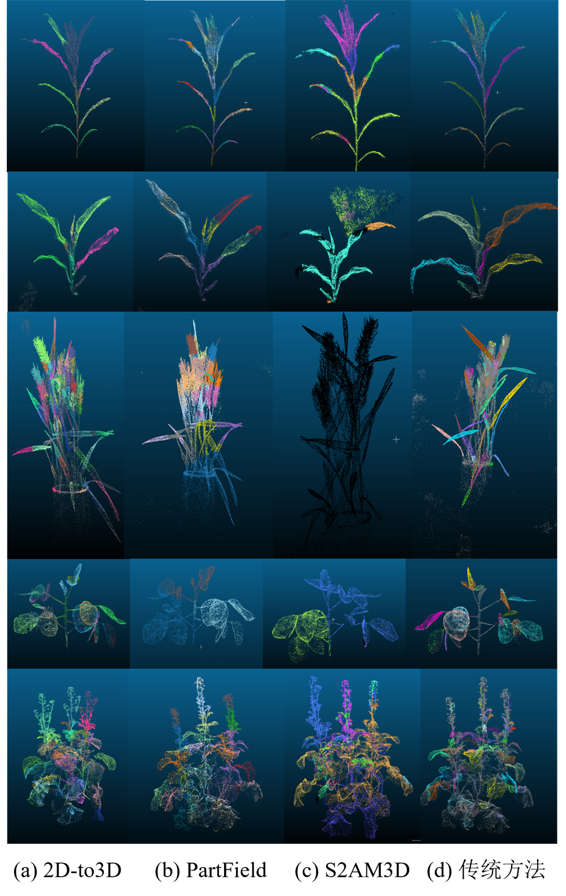
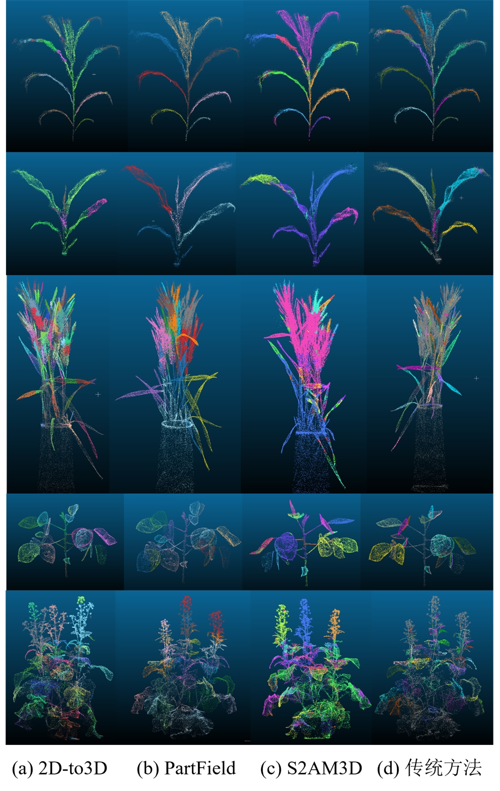

# 基于 3D Gaussian Splatting 的植物三维重建、点云分割与表型参数提取

本项目是模式识别与机器学习课程设计，围绕植物场景中的“可测量三维重建”展开。项目以单株植物多视角图像为输入，复现并比较 3D Gaussian Splatting 及其代表性改进方法，随后基于重建点云进行叶片语义/实例分割，并进一步提取叶片和植株级表型参数。

项目强调的不是单纯“看起来像”的可视化重建，而是面向表型测量的三维结果：点云应尽量干净、连通、完整，叶片边界应尽量清晰，才能支撑叶片分割和叶面积、叶长、株高等参数计算。

## 总体流程

```text
多视角植物图像
-> COLMAP / SfM 相机位姿估计与稀疏点云初始化
-> 3DGS 及其改进方法训练、渲染、点云导出
-> 重建质量评价：PSNR / SSIM / LPIPS + 点云几何指标
-> 叶片语义分割与单叶实例分割
-> 表型参数提取与误差分析
```

## 项目结构

```text
p3gs-recon-seg/
├── README.md
├── environment.yaml
├── data/                         # 全项目共享数据目录，大文件不上传
│   └── README.md
├── reconstruction/
│   ├── README.md
│   ├── source-codes/             # 重建论文源码 / 第三方复现代码
│   ├── scripts/                  # 本项目重建预处理、PLY修复、点云指标脚本
│   └── outputs/                  # 本地重建输出，不上传
├── segmentation/
│   ├── README.md
│   ├── source-codes/             # 分割论文源码 / 第三方复现代码
│   ├── scripts/                  # Grounded-SAM、S2AM3D、PartField、评估脚本
│   └── outputs/                  # 本地分割输出，不上传
├── phenotyping/
│   └── README.md
├── utils/                        # 本项目通用处理脚本，可上传
│   ├── README.md
│   ├── preprocess.py
│   ├── add_rgb_to_ply.py
│   └── fix_full_gaussian_ply.py
└── docs/                         # 补充说明文档
    └── assets/                   # README 可视化图片
```

`data/` 保留在项目根目录，因为重建、分割和表型提取都会复用同一批植物场景、点云和标注数据。各任务模块内部只放该阶段的论文源码、处理脚本和输出结果。

## 数据集与实验设置

报告 `reports/latex/main.tex` 中记录的原始数据为真实物理场景下采集的植物多视角图像，具备以下特点：

- 每株植物围绕中心轴线进行 `360°` 多视角采集，每个场景约 `60-200` 张图像。
- 原始图像分辨率为 `1080 x 1920`，纵向构图。
- 场景覆盖室内受控光照、室外自然光、盆栽土壤、塑料布、实验台等复杂背景。
- 使用 COLMAP 进行 SfM 稀疏重建，生成 3DGS 所需的相机内外参和初始化点云。
- 训练/测试划分采用 3DGS 默认 hold-out 策略，即按图像序列每隔 8 张抽取 1 张作为测试视角。

标准输入结构如下：

```text
plant_xxx/
├── images/
│   ├── 0.bmp
│   ├── 1.bmp
│   └── ...
└── sparse/
    └── 0/
        ├── cameras.bin
        ├── images.bin
        └── points3D.bin
```

本文重点选择五个代表性植物样本进行重建和分割实验：

| 样本 | 场景特点 | 主要考察问题 |
| --- | --- | --- |
| plant_002 | 线状细长叶片 | 大长宽比叶片、薄边界与细结构保持 |
| plant_003 | 低矮簇生植株 | 近景微小曲面、密集叶片和局部遮挡 |
| plant_013 | 穗状器官与高频细节 | 细粒度结构、复杂空间细节与局部模糊 |
| plant_016 | 薄壁结构边缘 | 零厚度边界、薄结构断裂与伪影控制 |
| plant_019 | 高度重叠繁茂植株 | 多层自遮挡、主体连通性与几何补全 |

## 复现与比较的方法

重建阶段复现和比较的方法包括：

| 方法 | 关注点 |
| --- | --- |
| 3DGS | 基线方法，显式三维高斯表示与实时渲染 |
| DepthSplat | 前馈式深度先验与 Gaussian Splatting 结合 |
| RaDe-GS | 深度、法线和几何一致性约束 |
| 2DGS | 二维表面圆盘高斯，适合薄表面表达 |
| GOF | Gaussian Opacity Field 与表面/连通性建模 |
| Scaffold-GS | 锚点结构化高斯表示，减少冗余 |
| LightGaussian | 剪枝、蒸馏和量化压缩 |
| Mip-Splatting | 多尺度抗混叠与稳定渲染 |
| Wheat3DGS | 面向植物/小麦场景的重建实验 |

分割阶段比较的方法包括：

| 方法 | 作用 |
| --- | --- |
| 2D-to-3D SAM / Grounded-SAM | 多视角二维掩码生成与三维投票融合 |
| S2AM3D | 可控尺度三维分割与交互式提示 |
| PartField | 三维特征场与聚类式部件分割 |
| 传统几何/聚类方法 | 法向、局部几何、区域生长、DBSCAN 等可解释基线 |

## 可视化示例

### 重建示例

以下示例来自 Plant3，用于直观展示同一植物场景下真实视图、标准 3DGS 和 GOF 重建结果的差异。

<table>
  <tr>
    <th>GT 真实视图</th>
    <th>3DGS</th>
    <th>GOF</th>
  </tr>
  <tr>
    <td></td>
    <td></td>
    <td></td>
  </tr>
</table>

### 分割示例

下图展示了不同分割方法在自动裁剪点云和人工清理点云上的实例分割可视化对比。

**Seg 自动裁剪输入**



**Handcraft 人工清理输入**



## 重建实验结果

### 分辨率实验

首先在 Plant1 上测试标准 3DGS 在不同输入分辨率下的表现，实验设备为 RTX 4090 32G。

| 下采样倍率 | PSNR | SSIM | LPIPS | 模型大小 | 训练时间 |
| ---: | ---: | ---: | ---: | ---: | ---: |
| 1 | 18.1313 | 0.5972 | 0.3135 | 1731 MB | 64 m 1 s |
| 2 | 19.5774 | 0.7041 | 0.2245 | 1229 MB | 37 m 6 s |
| 4 | 21.8779 | 0.8026 | 0.1451 | 677 MB | 20 m 47 s |
| 8 | 24.5072 | 0.8690 | 0.0959 | 277.6 MB | 11 m 36 s |

报告指出，低分辨率会使 PSNR/SSIM/LPIPS 数值更容易变好，并显著降低训练成本，但这并不等价于几何更准确，因为叶片边缘、细茎和纹理等高频细节也会被削弱。因此后续主要采用 `1/2` 分辨率，在效率和细节保留之间折中。

### 多方法整体结论

五个植物样本的横向比较显示，不同方法在渲染质量、几何质量、模型规模和训练效率之间存在明显取舍。

| 样本 | 渲染指标较优方法 | 几何/连通性观察 | 工程观察 |
| --- | --- | --- | --- |
| Plant2 | LightGaussian 最高 PSNR；RaDe-GS 最优 SSIM/LPIPS | GOF 主连通比例最高 `0.9957`，边缘强度也较好 | Wheat3DGS 训练最快 `3.66 min`，LightGaussian 模型仅 `64 MB` |
| Plant3 | 2DGS 最高 PSNR `21.3602`；RaDe-GS 最优 SSIM `0.7508` 和 LPIPS `0.1714` | Mip-Splatting 主连通比例 `0.9964`，RaDe-GS 异常点比例最低 `0.0682` | LightGaussian 压缩后仍保持较高 PSNR `21.3264` |
| Plant13 | LightGaussian 最高 PSNR `26.3913`；GOF 最优 SSIM/LPIPS | 2DGS 主连通比例最高 `0.9973` | LightGaussian 模型大小仅 `49 MB` |
| Plant16 | RaDe-GS 最高 PSNR `27.1185` 和最低 LPIPS `0.2814`；LightGaussian 最高 SSIM `0.8746` | GOF 主连通比例最高 `0.9960` | 2DGS 模型最小，仅 `29 MB` |
| Plant19 | GOF 最高 PSNR `29.3338` 和 SSIM `0.9197`；Mip-Splatting 最低 LPIPS `0.0984` | 标准 3DGS 主连通比例仅 `0.5176`，Mip-Splatting 提升到 `0.9929` | LightGaussian 模型最小 `85 MB`，但异常点比例较高 `0.3026` |

方法层面的主要认识：

- 标准 3DGS 渲染质量稳定，但在强遮挡场景中容易产生主体断裂和漂浮高斯。
- DepthSplat 具有快速前馈推理潜力，但在本项目植物场景中零样本和 1000 步微调结果都较弱，存在明显域差异。
- RaDe-GS 通过深度和法线约束改善几何一致性，尤其适合 Plant16 这类薄弱边界场景。
- 2DGS 更贴合叶片薄表面，但复杂遮挡和纹理变化场景下感知质量不一定最优。
- GOF 综合表现稳定，特别是主体连通性和复杂遮挡场景表现较好，但训练时间较长，例如 Plant2 达到 `84.12 min`。
- Scaffold-GS 结构化锚点减少冗余，但在本项目样本上的渲染指标整体不如 GOF、RaDe-GS 和 LightGaussian。
- LightGaussian 压缩优势明显，但剪枝后仍可能保留几何离群点。
- Mip-Splatting 在强遮挡和多尺度稳定性方面表现突出，但模型体积较大，例如 Plant19 达到 `406 MB`。
- Wheat3DGS 训练速度较快，但在多类盆栽植物上并不总是最优。

报告中特别强调：植物三维重建不能只看 PSNR、SSIM、LPIPS；异常点比例、主连通比例、BBox 体积等三维指标更直接影响后续点云分割和表型测量。

## 分割实验结果

分割实验使用 GOF 重建得到的 Plant2、Plant3、Plant13、Plant16、Plant19 五个点云，比较 `Seg` 自动裁剪输入和 `Handcraft` 人工清理输入。人工标注使用 CloudCompare 完成，其中 Plant2、Plant3、Plant13、Plant16、Plant19 分别标注了 `11 / 7 / 27 / 25 / 101` 个标签。

### 语义分割平均结果

| 指标 | 2D-to-3D Seg | S2AM3D Seg | PartField Seg | 传统 Seg | 2D-to-3D Handcraft | S2AM3D Handcraft | PartField Handcraft | 传统 Handcraft |
| --- | ---: | ---: | ---: | ---: | ---: | ---: | ---: | ---: |
| Leaf IoU | 67.11% | 47.77% | 69.24% | 57.27% | 83.35% | 81.21% | **86.38%** | 51.42% |
| Precision | 87.94% | 72.41% | 90.86% | **98.16%** | 87.75% | 92.03% | 93.04% | **97.29%** |
| Recall | **76.10%** | 50.69% | 75.69% | 57.88% | **95.35%** | 87.82% | 92.39% | 52.28% |
| F1 | 79.46% | 58.69% | 80.66% | 70.94% | 90.37% | 89.39% | **92.41%** | 65.81% |

结论：Handcraft 输入整体优于 Seg 输入，说明植物主体点云裁剪质量对语义分割影响明显。PartField 在 Handcraft 输入下取得最高 Leaf IoU 和 F1-score；2D-to-3D SAM 也受益于二维大模型先验。传统方法 Precision 高但 Recall 低，说明它较保守，误检少但漏检多。

### 实例分割平均结果

| 指标 | 2D-to-3D Seg | S2AM3D Seg | PartField Seg | 传统 Seg | 2D-to-3D Handcraft | S2AM3D Handcraft | PartField Handcraft | 传统 Handcraft |
| --- | ---: | ---: | ---: | ---: | ---: | ---: | ---: | ---: |
| F1@0.5 | 35.42% | 0.32% | 8.84% | **64.38%** | 34.60% | 23.42% | 48.91% | **49.82%** |
| F1@0.75 | 16.86% | 0.00% | 4.92% | **21.83%** | 25.44% | 12.65% | **32.33%** | 27.15% |
| PQ | 25.89% | 0.22% | 6.12% | **46.55%** | 27.85% | 17.05% | **39.89%** | 37.33% |
| ARI | **0.3956** | 0.0720 | 0.2134 | 0.3234 | 0.5366 | 0.2986 | **0.5732** | 0.2529 |

结论：实例分割明显难于语义分割。传统几何/聚类方法在 Seg 输入下粗粒度实例匹配较好，但边界精度有限；PartField 在 Handcraft 输入下 F1@0.75 和 ARI 最高，说明更干净的点云有利于特征聚类形成稳定实例。S2AM3D 在 Seg 输入下表现不稳定，可能与提示点位置、点云缺失和尺度参数有关。

## 表型参数提取结果

表型阶段基于实例分割点云计算整体植株参数和叶片级参数，包括株高、冠幅、叶片数量、叶面积、叶长、叶宽、叶倾角等。针对自动分割中的茎误检、离散点、叶片端部连接茎、多叶粘连等问题，报告设计了几何后处理：

- 整簇删除明显茎状实例。
- 裁剪叶片端部细长连接茎。
- 基于相对茎轴方向对粘连叶片进行二次切分。

大豆样本实验结果如下：

| 指标 | 数值 |
| --- | ---: |
| GT 叶片数 | 23 |
| GT 总叶面积 | 46148.09 mm² |
| 原始自动实例数 | 29 |
| 原始结果中茎误检实例数 | 8 |
| 人工确认叶片实例数 | 21 |
| 原始总叶面积（含茎误检） | 90043.25 mm² |
| 排除茎误检后总叶面积 | 77858.76 mm² |
| 含茎误检面积相对误差 | 95.12% |
| 排除茎误检面积相对误差 | 68.72% |
| 后处理输入点数 | 77745 |
| 后处理输出点数 | 72413 |
| 删除点数 / 比例 | 5332 / 6.86% |
| 后处理实例数 | 27 |
| 后处理点云高度 | 308.86 mm |
| 后处理总投影面积 | 52770.20 mm² |
| 后处理面积误差 | 6622.11 mm² |
| 后处理面积相对误差 | 14.35% |
| 平均叶长 | 68.49 mm |
| 平均叶宽 | 36.20 mm |
| 平均单叶投影面积 | 1954.45 mm² |

结果说明：几何后处理能显著降低叶面积估计误差，但当前方法仍是启发式流程，对茎叶粘连、遮挡缺失和复杂叶片边界仍需要人工检查或更精细的曲面面积估计。

## 环境配置

```bash
conda env create -f environment.yaml
conda activate plant3dgs
```

不同复现源码可能有额外依赖，尤其是 CUDA、PyTorch 版本、COLMAP、Grounded-SAM/SAM、Open3D、SciPy、Matplotlib 等。建议进入对应模块或第三方源码目录查看其原始说明。


## 局限性与后续方向

报告中总结的主要局限包括：

- 实验数据规模有限，主要围绕若干盆栽植物样本，泛化性仍需更大数据集验证。
- 几何真值有限，很多重建质量只能通过点云统计指标和下游任务间接评估。
- 分割仍受到人工裁剪和人工标注影响，自动化程度有待提高。
- 工程融合仍是初步探索，尚未形成端到端联合优化框架。

后续可以扩展更多植物类别和生长阶段，引入高精度扫描或人工测量真值，并建立更贴近表型任务的统一评价体系。


